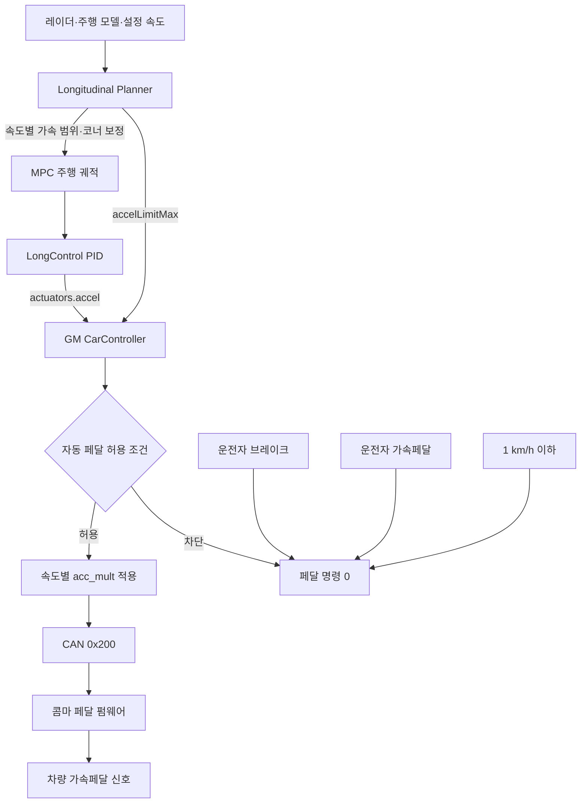
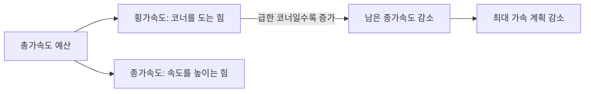
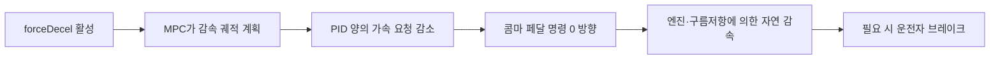
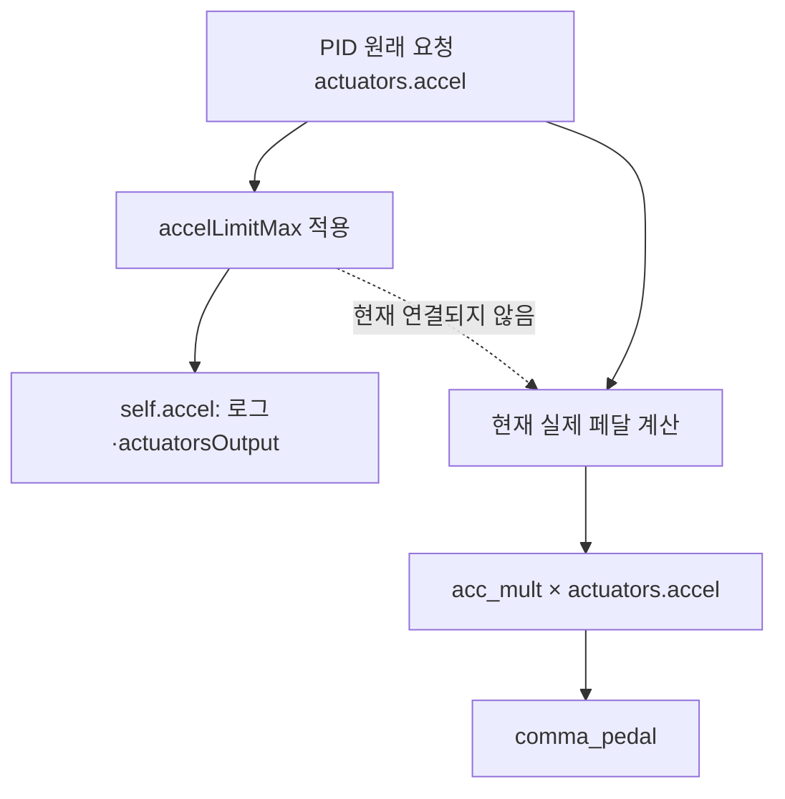
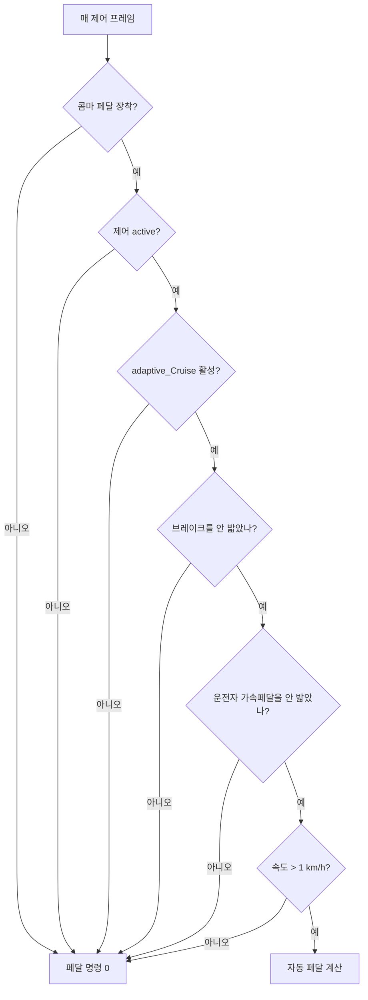

# 콤마 페달 쉬운 이해·튜닝 지침서

> 기준: 2026-07-24 현재 작업 트리의 GM 콤마 페달 소스
>
> 대상: `enableGasInterceptor = true`인 가속 전용 차량

## 1분 요약

콤마 페달은 **가속페달 신호를 대신 만들어 주는 장치**다. 이 구성에서는 브레이크를 제어하지 않는다.

- 설정 속도보다 느리면 PID가 필요한 가속도를 계산한다.
- 플래너는 앞차·코너·운전자 주의 상태를 보고 가속 계획을 조절한다.
- 감속이 필요하면 자동 페달을 줄이거나 `0`으로 만든다.
- 정차 차량이나 급감속 차량을 만나도 실제 브레이크는 운전자가 밟아야 한다.
- 운전자가 가속페달 또는 브레이크를 밟으면 자동 가속을 끄고 PID 누적값도 초기화한다.

현재 소스에는 중요한 불일치가 하나 있다.

> `accelLimitMax`를 적용해 `self.accel`은 제한하지만, 실제 페달 계산은 제한 전 값인 `actuators.accel`을 사용한다.
> 따라서 **현재 최종 페달 명령에는 `accelLimitMax` 상한이 직접 적용되지 않는다.**

## 전체 동작 차트



| 단계 | 쉽게 말하면 | 주요 소스 |
|---|---|---|
| 장착 감지 | 페달 CAN 메시지 `0x201`이 있는지 확인 | `selfdrive/car/gm/interface.py` |
| 운전자 페달 감지 | 두 페달 센서의 평균값으로 `gasPressed` 계산 | `selfdrive/car/gm/carstate.py` |
| 가속 범위 계산 | 속도별 최소·최대 가속도와 코너 한도 계산 | `selfdrive/controls/lib/longitudinal_planner.py` |
| 앞차 추종 | 앞차 거리·상대속도로 미래 궤적 계산 | `selfdrive/controls/lib/longitudinal_mpc_lib/long_mpc.py` |
| PID 제어 | 목표 속도와 실제 속도 차이를 가속 요청으로 변환 | `selfdrive/controls/lib/longcontrol.py` |
| 페달 변환 | 가속 요청에 속도별 `acc_mult` 적용 | `selfdrive/car/gm/carcontroller.py` |
| CAN 생성 | 명령·카운터·CRC 구성 | `selfdrive/car/__init__.py` |
| 하드웨어 출력 | 자동 명령과 운전자 페달 중 큰 값을 출력 | `panda/board/pedal/main.c` |

## 가장 헷갈리는 단위

### `_A_CRUISE_MIN_BP`는 km/h 값인가?

아니다. `v_ego`가 `m/s`이고 배열에 `CV.KPH_TO_MS` 변환이 없으므로 **숫자 자체가 m/s**다.

```python
_A_CRUISE_MIN_BP = [0., 15., 30., 55., 85.]
```

| 소스 숫자 | 실제 단위 | km/h 환산 |
|---:|---:|---:|
| 0 | 0 m/s | 0 km/h |
| 15 | 15 m/s | 54 km/h |
| 30 | 30 m/s | 108 km/h |
| 55 | 55 m/s | 198 km/h |
| 85 | 85 m/s | 306 km/h |

즉, 작성자가 `15, 30, 55, 85 km/h`를 의도했다면 현재 구현은 단위 변환이 빠진 것이다. 실제 km/h 기준점으로 쓰려면 각 값에 `CV.KPH_TO_MS`를 적용해야 한다.

### `_A_TOTAL_MAX_BP`와 `_A_TOTAL_MAX_V`의 단위

```python
_A_TOTAL_MAX_V = [2.5, 3.0, 4.0]
_A_TOTAL_MAX_BP = [0., 25., 55.]
```

두 배열의 역할과 단위가 서로 다르다.

| 배열 | 의미 | 실제 단위 |
|---|---|---|
| `_A_TOTAL_MAX_BP` | 속도 기준점 | m/s = `0, 90, 198 km/h` |
| `_A_TOTAL_MAX_V` | 그 속도에서 허용하는 총가속도 | m/s² = `2.5, 3.0, 4.0` |

따라서 `[2.5, 3.0, 4.0]`은 km/h가 아니라 **타이어에 허용할 총가속도 예산**이다. 값 자체는 가속도 수치로 유효하다.

다만 `# 회전 시 가속 제한을 낮춤`이라는 주석과 실제 변경 방향은 일치하지 않는다. 원본의 저속 총가속도 한도 `1.7 m/s²`보다 현재 저속 값 `2.5 m/s²`가 크므로, 같은 코너라면 오히려 제한이 느슨해질 수 있다.

## 현재 속도별 기본 가속 범위

현재 `calc_cruise_accel_limits()`는 앞차 유무를 구분하지 않고 항상 `_FOLLOWING` 배열을 사용한다.

```python
_A_CRUISE_MIN_V_FOLLOWING = [-1.5, -1.5, -1.2, -1.0, -0.8]
_A_CRUISE_MAX_V_FOLLOWING = [ 1.0,  0.9,  0.7,  0.5,  0.4]
```

`_A_CRUISE_MIN_V`와 `_A_CRUISE_MAX_V`도 선언돼 있지만 현재 함수에서는 사용하지 않는다.


| 실제 차량 속도 | 최소 계획값 | 최대 계획값 | 해석 |
|---:|---:|---:|---|
| 0 km/h | -1.500 m/s² | 1.000 m/s² | 저속 기본 범위 |
| 20 km/h | -1.500 m/s² | 0.963 m/s² | 최대값이 조금 감소 |
| 40 km/h | -1.500 m/s² | 0.926 m/s² | 완만하게 감소 |
| 54 km/h | -1.500 m/s² | 0.900 m/s² | 두 번째 기준점 |
| 80 km/h | -1.356 m/s² | 0.804 m/s² | 중속 가속 완화 |
| 100 km/h | -1.244 m/s² | 0.730 m/s² | 재가속이 더 부드러움 |
| 108 km/h | -1.200 m/s² | 0.700 m/s² | 세 번째 기준점 |
| 130 km/h | -1.151 m/s² | 0.651 m/s² | 고속 상한 감소 |
| 198 km/h | -1.000 m/s² | 0.500 m/s² | 네 번째 기준점 |
| 306 km/h 이상 | -0.800 m/s² | 0.400 m/s² | 마지막 값 유지 |

이 값은 페달 명령이 아니라 **MPC가 계획할 수 있는 가속도 범위**다.

앞차가 감지되면 `long_mpc.py`는 최소 가속 한도를 별도로 `MIN_ACCEL = -3.5 m/s²`까지 바꾼다. 이것은 강한 감속 궤적을 계산할 수 있다는 뜻이지, 콤마 페달이 브레이크를 만든다는 뜻은 아니다.

## 코너 보정

코너에서는 타이어의 힘을 회전과 가속이 나누어 쓴다고 보면 쉽다.



```text
허용 종가속도 = √(총가속도 한도² - 계산 횡가속도²)
최종 최대값   = min(속도별 기본 최대값, 허용 종가속도)
```

| 실제 속도 | 총가속도 한도 |
|---:|---:|
| 0 km/h | 2.50 m/s² |
| 50 km/h | 약 2.78 m/s² |
| 90 km/h | 3.00 m/s² |
| 100 km/h | 약 3.09 m/s² |
| 130 km/h | 약 3.37 m/s² |
| 198 km/h 이상 | 4.00 m/s² |

기본 최대 종가속도가 `1.0 m/s²` 이하라서 완만한 코너에서는 이 보정이 작동하지 않을 수 있다. 횡가속도가 충분히 커져 남은 종가속도 예산이 기본 상한보다 작아질 때만 추가 제한된다.

현재 횡가속도는 조향각·조향비·축거로 근사한다.

## `forceDecel`과 가속 전용 차량

운전자 주의 저하로 `forceDecel`이 켜지면 플래너의 최대 계획값을 `-0.2 m/s²` 방향으로 제한한다.



그러나 콤마 페달 차량의 PID 하한은 다음 코드로 `0.0 m/s²`가 된다.

```python
accel_min = 0.0 if CP.enableGasInterceptor else params.ACCEL_MIN
```

즉, 음수 계획은 자동 브레이크가 아니라 **가속을 끊게 만드는 정보**다. 내리막에서는 페달 명령이 `0`이어도 속도가 유지되거나 증가할 수 있다.

직전 계획과 갑자기 벌어지지 않도록 프레임당 약 `0.05 m/s²`의 연속성 보정이 적용되고, `0.5 m/s` 미만에서는 정지 직전 감속을 완화하는 코드도 있다. 따라서 실제 계획값은 즉시 정확히 `-0.2`가 되지 않을 수 있다.

## `accelLimitMax` 공급과 현재 적용 경로

플래너는 매 주기 속도별 기본 최대 가속도를 발행한다.

```python
accel_limits = calc_cruise_accel_limits(v_ego)
self.accel_limit_max = float(accel_limits[1])
longitudinalPlan.accelLimitMax = self.accel_limit_max
```

주의할 점은 이 값이 **코너 보정 전·`forceDecel` 적용 전 기본 최대값**이라는 것이다. 이름만 보고 현재 MPC의 최종 동적 상한이라고 해석하면 안 된다.

GM 제어기 안에서는 다음처럼 상한을 계산한다.

```python
requested_accel = min(requested_accel, comfort_accel_cap)
self.accel = requested_accel
```

하지만 실제 페달 계산은 현재 다음과 같다.

```python
pedal_command = acc_mult * actuators.accel
self.comma_pedal = clip(pedal_command, 0., 0.85)
```



예를 들어 PID가 `1.0 m/s²`, `accelLimitMax`가 `0.6 m/s²`, `acc_mult`가 `0.23`이면:

| 항목 | 현재 값 |
|---|---:|
| PID 원래 요청 | 1.00 m/s² |
| `self.accel`과 CSV의 적용 가속도 | 0.60 m/s² |
| 상한을 올바르게 쓴 페달 명령 | `0.23 × 0.60 = 0.138` |
| 현재 실제 소스의 페달 명령 | `0.23 × 1.00 = 0.230` |

따라서 공급 경로는 연결돼 있지만, **최종 소비 지점이 제한 후 값이 아니라 제한 전 값을 사용한다.** 튜닝 전에 `pedal_command = acc_mult * self.accel`로 경로를 일치시키는 것이 우선이다.

## 현재 속도별 페달 맵

현재 활성 맵은 다음과 같다. 기준점에 `CV.KPH_TO_MS`가 있으므로 여기의 숫자는 실제 km/h 의도와 일치한다.

| 속도 | `acc_mult` |
|---:|---:|
| 0 km/h | 0.150 |
| 10 km/h | 0.165 |
| 18 km/h | 0.180 |
| 30 km/h | 0.210 |
| 60 km/h | 0.230 |
| 80 km/h 이상 | 0.250 |

```text
현재 실제 페달 명령 = clip(acc_mult × actuators.accel, 0.0, 0.85)
```

| PID 요청 | 속도 | 계산된 페달 명령 |
|---:|---:|---:|
| 0.8 m/s² | 20 km/h | 약 0.148 |
| 0.8 m/s² | 30 km/h | 0.168 |
| 0.8 m/s² | 60 km/h | 0.184 |
| 0.8 m/s² | 80 km/h | 0.200 |

PID 출력 최대값은 `2.0 m/s²`이고 `acc_mult` 최대값은 `0.25`이므로 정상 경로에서 계산되는 최대 페달 명령은 약 `0.50`이다. 코드의 최종 클립 `0.85`는 그보다 높은 비상 상한에 가깝다.

또한 주석에는 “최대 0.8”이라고 적혀 있지만 실제 코드는 `0.85`다.

## 현재 활성 종방향 PID 게인

기준점에는 `CV.KPH_TO_MS`가 적용돼 있어 표의 속도는 실제 km/h다.

| 속도 | `kp` |
|---:|---:|
| 0 | 0.80 |
| 5 | 0.74 |
| 10 | 0.66 |
| 20 | 0.61 |
| 30 | 0.56 |
| 50 | 0.51 |
| 60 | 0.46 |
| 80 | 0.42 |
| 130 | 0.38 |

| 속도 | `ki` |
|---:|---:|
| 0 km/h | 0.16 |
| 25 km/h | 0.12 |
| 130 km/h | 0.08 |

속도가 높아질수록 게인이 낮아져 재가속과 목표 속도 접근이 부드러워지는 방향이다. 다만 페달 맵과 상한 경로가 맞지 않은 상태에서 PID부터 조정하면 원인을 구분하기 어렵다.

## 자동 페달 허용 조건

다음 조건을 모두 만족해야 페달 명령이 만들어진다.



운전자 가속페달과 브레이크는 `LongControl` PID도 초기화한다. 운전자가 페달을 놓은 뒤 숨은 적분값이 갑자기 출력되는 것을 막기 위한 처리다.

장착 감지는 파워트레인 CAN 버스의 `GAS_SENSOR(0x201)` 존재 여부로 한다. 운전자 가속페달은 두 센서 평균이 `15`보다 크면 눌림으로 판정하고, 파서는 이 메시지를 `50 Hz`로 기대한다.

## 버튼 동작

- `SET` 또는 `RES` 버튼을 놓으면 ACC와 LKAS를 활성화한다.
- `CANCEL`을 누르면 ACC와 LKAS를 비활성화한다.
- `MAIN` 버튼 이벤트는 자동 페달 상태를 즉시 바꾸는 스위치로 취급한다.
- MAIN 원시 CAN 신호만 달라진 경우 약 1초 동안 상태가 유지돼야 반영한다.

## 실제 운전 스타일

| 상황 | 현재 동작 | 운전자가 느끼는 변화 |
|---|---|---|
| 저속에서 설정 속도보다 느림 | 최대 약 `1.0 m/s²` 범위에서 PID 가속 | 비교적 적극적으로 복귀 |
| 속도가 높아짐 | 계획 최대값은 서서히 감소 | 고속 재가속이 완만해짐 |
| 앞차가 느려짐 | MPC가 음수 감속 궤적도 계산 | 실제로는 가속을 줄이고 자연 감속 |
| 급한 코너 | 남은 종가속도 예산이 작을 때 계획 상한 감소 | 코너 중 가속 완화 |
| `forceDecel` 활성 | 음수 계획, PID 출력은 0 방향 | 발을 뗀 것처럼 자연 감속 |
| 운전자 가속페달 | 자동 페달 0, PID 초기화 | 운전자가 직접 가속 |
| 운전자 브레이크 | 자동 페달 0, PID 초기화 | 운전자가 직접 감속 |
| 1 km/h 이하 | 자동 페달 0 | 자동 출발하지 않음 |

다만 현재 `accelLimitMax` 우회 때문에 “속도가 높아질수록 계획 상한이 감소”하는 효과가 최종 페달 명령에 그대로 보장되지는 않는다.

## CAN과 펌웨어

`GAS_COMMAND(0x200)`에는 두 채널의 페달 명령, 활성 비트, 4비트 카운터와 CRC-8이 들어간다.

펌웨어는 정상 상태에서 다음처럼 출력한다.

```text
DAC 1 = max(자동 명령 1, 운전자 페달 1)
DAC 2 = max(자동 명령 2, 운전자 페달 2)
```

오류 상태에서는 자동 명령을 버리고 운전자 페달을 그대로 출력한다.

### 정적 소스 검토에서 발견되는 통신 불일치

| 항목 | 현재 송신 측 | 현재 펌웨어 측 | 영향 가능성 |
|---|---:|---:|---|
| 명령 주기 | 약 25 Hz, 40 ms | 타이머 주석 약 732 Hz, 타임아웃 10틱 ≈ 14 ms | 다음 명령 전에 `FAULT_TIMEOUT` 가능 |
| 롤링 카운터 | `0→1→2→3→0` | `0~15` 연속 증가 기대 | `3→0` 패킷 거부 가능 |

이는 소스만 보고 판단한 결과다. 실제 하드웨어 타이머와 CAN 로그에서 `GAS_SENSOR.STATE`, 명령 간격, 수신 카운터를 확인해야 한다.

GM Panda 안전 훅도 브레이크·가속페달 상태를 계산하지만, 현재 `current_controls_allowed`에는 계산된 `pedal_pressed`가 반영되지 않는다. 자동 페달 차단이 주로 Python 제어기 한 계층에 의존하는 상태이므로 별도 안전 검토가 필요하다.

## 경량 페달 튜닝 CSV

전체 `loggerd`는 현재 프로세스 목록에서 주석 처리돼 있지만, 콤마 페달 튜닝 CSV는 별도 백그라운드 스레드로 기록한다.

| 환경 | 저장 폴더 |
|---|---|
| 차량 장치 | `/data/log/pedal_tuning/` |
| PC | `~/.comma/log/pedal_tuning/` |

기록 조건과 용량:

- GM 콤마 페달 장착 차량
- `PedalTuningLogEnabled=1`
- 최대 `10 Hz`
- 파일당 약 `5 MB`
- 최근 10개 파일, 총 약 `50 MB`
- 약 1초마다 버퍼 플러시
- 쓰기 큐가 가득 차면 제어 루프를 막지 않고 샘플을 버림

| CSV 컬럼 | 의미 |
|---|---|
| `v_ego_kph` | 차량 속도 |
| `pid_accel_request_mps2` | 상한 적용 전 PID 요청 |
| `accel_limit_max_mps2` | 플래너의 기본 최대값 |
| `applied_accel_mps2` | `self.accel`, 즉 상한 적용 후 진단값 |
| `pedal_command` | 실제 최종 페달 명령 |
| `vehicle_accel_mps2` | 측정 차량 가속도 |
| `brake_pressed`, `gas_pressed` | 운전자 입력 |
| `controls_active`, `adaptive_cruise` | 자동 제어 상태 |

현재 상한 우회 여부는 다음처럼 바로 확인할 수 있다.

```text
pid_accel_request > accel_limit_max
그리고
pedal_command ≈ acc_mult × pid_accel_request
```

이 패턴이면 실제 페달이 `applied_accel_mps2`가 아니라 제한 전 PID 요청을 사용하고 있다는 뜻이다.

## 튜닝 권장 순서


1. 속도 기준점이 m/s인지 km/h 변환값인지 먼저 확정한다.
2. 최종 페달 계산이 제한 후 값 `self.accel`을 사용하도록 연결한다.
3. CAN 명령 주기, 펌웨어 타임아웃과 4비트 카운터를 일치시킨다.
4. 평지에서 속도 구간별 `pedal_command → vehicle_accel_mps2`를 기록한다.
5. 같은 요청에 실제 가속도가 일정해지도록 `acc_mult`를 먼저 조정한다.
6. 그 다음 목표 속도 접근성과 잔여 오차를 보며 `kp`, `ki`를 조정한다.

## 빠른 진단표

| 증상 | 우선 확인할 값 |
|---|---|
| PID 요청은 큰데 적용 가속도가 작음 | `accelLimitMax` |
| 적용 가속도는 작지만 페달 명령이 큼 | `actuators.accel` 우회 경로 |
| 페달 명령이 계속 0 | `active`, `adaptive_Cruise`, 속도, 브레이크·가속페달 |
| 페달 명령은 있는데 실제 가속이 없음 | CAN `0x200`, CRC, 카운터, `GAS_SENSOR.STATE` |
| 약 40 ms마다 페달이 끊기는 느낌 | 25 Hz 송신과 펌웨어 타임아웃 |
| 운전자 페달을 놓은 뒤 튀는 현상 | PID reset 여부와 `gasPressed` 임계값 |

## 안전 주의

이 구현은 자동 브레이크를 제공하지 않는다. 앞차 급감속이나 정지 장애물 상황에서 가속을 끊는 것만으로 충돌을 피할 수 있다고 가정하면 안 된다. FCW도 경고일 뿐 제동 장치가 아니므로 운전자는 항상 직접 제동할 준비를 해야 한다.
