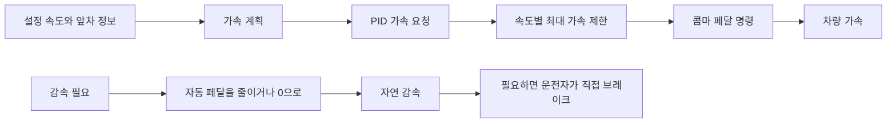
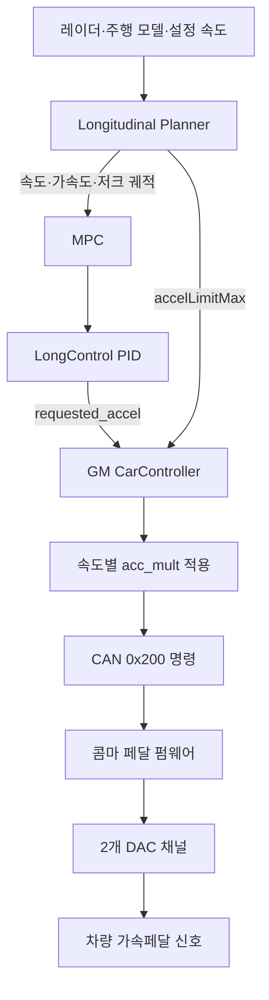
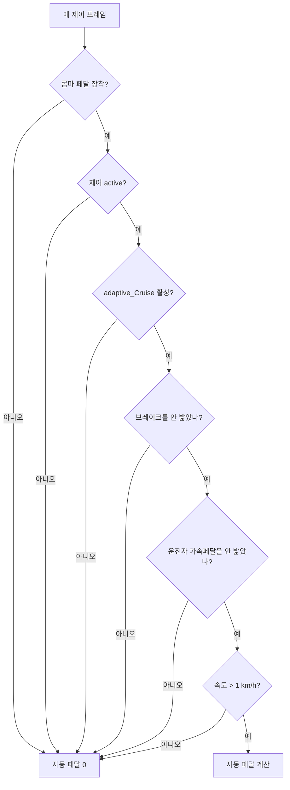
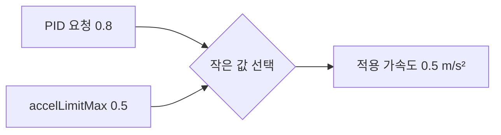

# 콤마 페달 쉬운 이해·운용 지침서

> 기준: 2026-07-23 현재 작업 트리의 GM 콤마 페달 소스
>
> 대상: `enableGasInterceptor = true`인 가속 전용 차량

## 먼저 알아둘 핵심

콤마 페달은 **가속페달을 대신 눌러 주는 장치**다. 이 구현은 브레이크를 제어하지 않는다.

- 설정 속도보다 느리면 필요한 만큼 가속한다.
- 앞차나 코너 때문에 감속이 필요하면 우선 가속을 줄이거나 끊는다.
- 정차 차량, 급감속 차량을 만났을 때 자동 브레이크를 걸 수 없다.
- 정차 상태에서는 자동 출발하지 않으며 운전자가 직접 출발해야 한다.
- 운전자가 가속페달이나 브레이크를 밟으면 운전자 입력을 우선한다.



## 1. 전체 동작 순서



| 단계 | 쉽게 말하면 | 주요 소스 |
|---|---|---|
| 장착 감지 | 콤마 페달이 연결됐는지 확인 | `selfdrive/car/gm/interface.py` |
| 페달 상태 읽기 | 운전자가 페달을 밟았는지 확인 | `selfdrive/car/gm/carstate.py` |
| 가속 계획 | 앞으로 어느 속도로 달릴지 계산 | `selfdrive/controls/lib/longitudinal_planner.py` |
| 차간거리 계산 | 앞차 거리와 상대속도를 반영 | `selfdrive/controls/lib/longitudinal_mpc_lib/long_mpc.py` |
| PID 제어 | 계획 속도와 실제 속도의 차이를 가속 요청으로 변환 | `selfdrive/controls/lib/longcontrol.py` |
| 최종 페달 계산 | 상한과 차단 조건을 적용 | `selfdrive/car/gm/carcontroller.py` |
| CAN 패킷 생성 | 명령, 카운터, CRC를 구성 | `selfdrive/car/__init__.py` |
| 하드웨어 출력 | 두 페달 신호를 차량에 전달 | `panda/board/pedal/main.c` |

## 2. 콤마 페달 장착 감지

파워트레인 CAN 버스에 `GAS_SENSOR(0x201)`가 있으면 콤마 페달 장착 차량으로 판단한다.

```python
ret.enableGasInterceptor = 0x201 in fingerprint[0]
```

장착 차량에서는 두 센서 값을 평균 내어 운전자 페달 상태를 계산한다.

```text
INTERCEPTOR_GAS ─┐
                 ├─ 평균값 > 15 ── gasPressed = true
INTERCEPTOR_GAS2 ┘
```

현재 `carstate.py`는 두 값의 차이를 별도로 검사하지 않고 평균만 사용한다. CAN 파서는 `0x201`을 `50 Hz`로 기대한다.

## 3. 자동 페달이 작동하는 조건

다음 조건을 **모두** 만족해야 자동 페달 명령이 만들어진다.



따라서 다음 상황에서는 명령이 `0`이 된다.

- ACC 또는 제어기가 비활성
- 브레이크를 밟음
- 운전자가 가속페달을 밟음
- 차량이 정차 중
- 속도가 `1 km/h` 이하

운전자 가속페달이나 브레이크가 감지되면 `LongControl`의 PID도 초기화한다. 운전자가 페달을 놓았을 때 이전 적분값 때문에 갑자기 가속하는 것을 막기 위한 처리다.

### 버튼 동작

- `SET` 또는 `RES` 버튼을 놓으면 ACC와 LKAS를 활성화한다.
- `CANCEL`을 누르면 ACC와 LKAS를 비활성화한다.
- `MAIN` 버튼은 자동 페달을 즉시 끄는 스위치로 사용한다.
- CAN의 `CruiseMainOn` 값만 변한 경우에는 약 1초 동안 같은 상태가 유지되어야 반영한다.

## 4. 속도별 기본 가속도 범위

플래너는 다음 기준점 사이를 선형 보간한다.

```python
속도 기준 = [0, 15, 30, 55, 85] km/h
최소 계획 = [-1.5, -1.5, -1.2, -1.0, -0.8] m/s²
최대 계획 = [ 1.0,  0.9,  0.7,  0.5,  0.4] m/s²
```

소스에서는 각 속도에 `CV.KPH_TO_MS`를 곱하므로 기준점은 실제로 `km/h` 의미가 맞다.


| 차량 속도 | 최소 계획값 | 최대 계획값 | 운전 느낌 |
|---:|---:|---:|---|
| 0 km/h | -1.500 m/s² | 1.000 m/s² | 저속 가속 여유가 가장 큼 |
| 20 km/h | -1.400 m/s² | 0.833 m/s² | 비교적 빠르게 속도 회복 |
| 40 km/h | -1.120 m/s² | 0.620 m/s² | 가속이 점차 부드러워짐 |
| 60 km/h | -0.967 m/s² | 0.483 m/s² | 완만하게 속도 회복 |
| 80 km/h | -0.833 m/s² | 0.417 m/s² | 고속 재가속을 억제 |
| 100 km/h | -0.800 m/s² | 0.400 m/s² | 마지막 상한을 유지 |

이 숫자는 페달에 바로 보내는 명령이 아니다. MPC가 계획할 수 있는 가속도 범위다.

### 현재 프로파일 선택 방식

`calc_cruise_accel_limits()`는 앞차 유무와 관계없이 항상 `FOLLOWING` 배열을 사용한다.

```text
앞차 있음 ─┐
           ├─ 같은 FOLLOWING 가속도 범위 사용
앞차 없음 ─┘
```

`_A_CRUISE_MIN_V`와 `_A_CRUISE_MAX_V`도 정의돼 있지만 현재 계산에서는 사용하지 않는다. 다만 앞차 정보 자체는 MPC에 전달되므로 실제 차간거리 계획에는 계속 반영된다.

## 5. 코너에서는 왜 가속이 줄어드는가

타이어가 사용할 수 있는 힘을 하나의 예산으로 보면 이해하기 쉽다.


```text
허용 종가속도 = √(총가속도 한도² - 횡가속도²)
최종 최대값   = min(기본 최대값, 허용 종가속도)
```

총가속도 한도는 다음과 같다.

| 속도 기준 | 총가속도 한도 |
|---:|---:|
| 0 km/h | 2.5 m/s² |
| 25 km/h | 3.0 m/s² |
| 55 km/h 이상 | 4.0 m/s² |

운전 느낌은 다음과 같이 변한다.

- 직선: 기본 가속을 사용
- 완만한 코너: 변화가 작을 수 있음
- 빠르거나 급한 코너: 가속을 줄임
- 코너를 빠져나옴: 다시 기본 가속 범위로 복귀

코너 제한은 MPC 계획에 적용된다. 현재 발행되는 `accelLimitMax`는 코너 보정 전의 **기본 최대값**이다.

## 6. 운전자 주의 저하 보정

운전자 주의 저하로 `forceDecel`이 켜지면 플래너는 최대 계획값을 `-0.2 m/s²` 이하로 제한한다.

```text
주의 정상
→ 필요한 경우 가속 계획

forceDecel 활성
→ MPC가 감속 방향으로 계획
→ PID 가속 요청 감소
→ 콤마 페달 명령이 0에 가까워짐
→ 차량 자연 감속
```

콤마 페달은 브레이크를 만들 수 없다. 내리막에서는 가속 명령이 `0`이어도 속도가 줄지 않거나 오를 수 있으므로 운전자가 직접 브레이크를 밟아야 한다.

직전 목표 가속도와 갑자기 벌어지지 않도록 연속성 보정을 적용하므로, 최대 계획값이 한 번에 `-0.2 m/s²`까지 떨어지지 않고 프레임마다 점진적으로 내려갈 수 있다. 또한 `0.5 m/s` 미만에서는 감속 계획 상한을 `-0.1 m/s²`까지 완화한다.

콤마 페달 차량의 실제 PID 출력 범위는 `0.0~2.0 m/s²`다. 따라서 MPC의 음수 계획은 브레이크 명령으로 전달되지 않고, PID의 양의 가속 요청을 줄이는 방향으로만 작용한다. 이때 발행되는 `accelLimitMax`는 여전히 속도별 기본 상한이며 `forceDecel` 값을 직접 발행하는 필드는 아니다.

## 7. `accelLimitMax`가 하는 일

플래너는 현재 속도의 기본 최대 가속도를 매 주기 발행한다.

```python
accel_limits = calc_cruise_accel_limits(v_ego)
self.accel_limit_max = float(accel_limits[1])
longitudinalPlan.accelLimitMax = self.accel_limit_max
```

GM 제어기는 PID 요청이 이 상한을 넘지 못하게 한다.

```python
comfort_accel_cap = max(0.0, longitudinalPlan.accelLimitMax)
if requested_accel > 0.0:
  requested_accel = min(requested_accel, comfort_accel_cap)
```



| PID 요청 | 상한 | 최종 적용 |
|---:|---:|---:|
| 0.3 | 0.5 | 0.3 m/s² |
| 0.8 | 0.5 | 0.5 m/s² |
| 1.2 | 0.7 | 0.7 m/s² |

`accelLimitMax`는 목표값이 아니라 **넘지 말아야 하는 천장값**이다.

## 8. 가속도를 실제 페달 명령으로 변환

상한을 적용한 가속도에 속도별 배율을 곱한다.

```text
페달 명령 = clip(acc_mult × 적용 가속도, 0.0, 0.75)
```

| 속도 | `acc_mult` |
|---:|---:|
| 0 km/h | 0.132 |
| 10 km/h | 0.145 |
| 18 km/h | 0.158 |
| 30 km/h | 0.185 |
| 40 km/h | 0.182 |
| 60 km/h | 0.168 |
| 80 km/h | 0.178 |
| 100 km/h 이상 | 0.188 |

예를 들어 60 km/h에서 적용 가속도가 `0.48 m/s²`라면:

```text
0.168 × 0.48 = 0.08064
```

최종 페달 명령은 약 `0.081`이 된다.

## 9. 실제 운전 스타일

| 상황 | 콤마 페달 동작 | 운전자가 느끼는 변화 |
|---|---|---|
| 설정 속도보다 느림 | 제한 범위 안에서 가속 | 설정 속도로 복귀 |
| 속도가 높아짐 | 최대 가속 상한 감소 | 고속에서 재가속이 부드러움 |
| 앞차가 느려짐 | MPC 요청 감소 | 가속을 놓고 자연 감속 |
| 급한 코너 | MPC 최대 가속 감소 | 코너 중 가속이 약해짐 |
| `forceDecel` 활성 | 감속 계획, 페달 출력 감소 | 발을 뗀 것처럼 자연 감속 |
| 운전자 가속페달 | 자동 페달 0, PID 초기화 | 운전자가 직접 가속 |
| 운전자 브레이크 | 자동 페달 0, PID 초기화 | 운전자가 직접 감속 |
| 정차 또는 1 km/h 이하 | 자동 페달 0 | 자동 출발하지 않음 |

전체적으로 **저속에서는 필요한 만큼 반응하고, 속도가 높아질수록 부드럽게 가속하며, 코너와 앞차 상황에서는 가속을 먼저 놓는 운전 스타일**이다.

## 10. CAN 명령과 펌웨어

`GAS_COMMAND(0x200)`에는 다음 정보가 들어간다.

| 필드 | 역할 |
|---|---|
| `GAS_COMMAND`, `GAS_COMMAND2` | 두 페달 채널의 명령 |
| `ENABLE` | 명령이 `0.001`보다 클 때 활성 |
| `COUNTER_PEDAL` | 패킷 순서 확인 |
| `CHECKSUM_PEDAL` | 다항식 `0xD5` CRC-8 |

펌웨어는 운전자 페달과 자동 명령 중 큰 값을 출력한다.

```text
DAC 1 = max(자동 명령 1, 운전자 페달 1)
DAC 2 = max(자동 명령 2, 운전자 페달 2)
```

체크섬, 전송 또는 타임아웃 오류가 생기면 자동 명령을 사용하지 않고 운전자 페달 값을 그대로 출력한다.

## 11. 현재 소스에서 확인이 필요한 부분

### CAN 명령 주기와 펌웨어 타임아웃

| 항목 | 소스상 값 |
|---|---:|
| GM 페달 명령 | `frame % 4 == 0`, 약 25 Hz |
| 명령 간격 | 약 40 ms |
| 펌웨어 타이머 | 주석 기준 약 732 Hz |
| `MAX_TIMEOUT` | 10틱, 약 14 ms |

주석과 실제 하드웨어 클록이 일치한다면 다음 명령 전에 `FAULT_TIMEOUT`이 발생할 수 있다. 실제 CAN 수신 간격과 펌웨어 상태를 계측해야 한다.

### 롤링 카운터 범위

펌웨어는 4비트 카운터 `0~15`의 연속 증가를 기대하지만 GM 제어기는 `0~3`을 반복한다.

```text
펌웨어 기대: 0 → 1 → 2 → 3 → 4 → ... → 15 → 0
현재 송신:   0 → 1 → 2 → 3 → 0 → 1 → 2 → 3
```

`3 → 0` 패킷은 펌웨어가 기대하는 다음 값과 다르므로 실제 CAN 로그에서 적용 여부를 확인해야 한다.

### Panda GM 안전 훅

GM 안전 훅은 브레이크 상태를 계산하지만 현재 `current_controls_allowed`에 `pedal_pressed`를 반영하지 않는다. 자동 페달 0 처리가 주로 `carcontroller.py`에 의존하므로 안전 계층의 의도와 구현을 별도로 검토해야 한다.

## 12. 문제 진단 순서

| 순서 | 확인 로그 | 확인할 내용 |
|---:|---|---|
| 1 | `longitudinalPlan.accels` | MPC가 가속을 계획하는가 |
| 2 | `longitudinalPlan.accelLimitMax` | 현재 속도의 상한이 발행되는가 |
| 3 | `pedalDeadzoneAccelRequest` | 상한 적용 전 PID 요청 |
| 4 | `pedalComfortAccelCap` | `accelLimitMax`와 같은가 |
| 5 | `carControl.actuatorsOutput.accel` | 상한과 차단 조건 적용 결과 |
| 6 | `pedalDeadzoneAppliedCommand` | 최종 페달 명령 |
| 7 | `pedalDeadzoneVehicleAccel` | 실제 차량 가속도 |
| 8 | `gasPressed`, `brakePressed`, `standstill` | 운전자 우선 또는 정차 차단 여부 |
| 9 | `GAS_SENSOR.STATE` | `NO_FAULT`인지 확인 |

```text
PID 요청 > 0, accelLimitMax = 0
→ 플래너 메시지 유효성과 발행 경로 확인

적용 가속도 > 0, 페달 명령 = 0
→ active, adaptive_Cruise, 속도, 운전자 입력 확인

페달 명령 > 0, 실제 가속도 변화 없음
→ CAN 0x200, 카운터, CRC, 펌웨어 상태와 배선 확인

STATE = FAULT_TIMEOUT
→ 명령 주기와 펌웨어 타이머 확인
```

## 13. 경량 페달 튜닝 CSV

전체 `loggerd`가 꺼져 있어도 콤마 페달 차량에서는 필요한 값만 별도 CSV에 `10 Hz`로 기록한다. 파일 쓰기는 백그라운드 스레드가 담당하므로 100 Hz 제어 루프는 디스크를 기다리지 않는다.

| 환경 | 저장 폴더 |
|---|---|
| 차량 장치 | `/data/log/pedal_tuning/` |
| PC | `~/.comma/log/pedal_tuning/` |

파일 이름은 다음 형식이다.

```text
pedal_tuning_YYYYMMDD_HHMMSS_000.csv
```

주요 컬럼은 다음과 같다.

| 컬럼 | 의미 |
|---|---|
| `utc_time` | 사람이 읽을 수 있는 UTC 시간 |
| `mono_time_s` | 부팅 후 단조 증가 시간 |
| `v_ego_mps`, `v_ego_kph` | 차량 속도 |
| `pid_accel_request_mps2` | 상한 적용 전 PID 요청 |
| `accel_limit_max_mps2` | 플래너의 속도별 기본 가속 상한 |
| `applied_accel_mps2` | 상한과 차단 조건 적용 후 가속도 |
| `pedal_command` | 최종 콤마 페달 명령 |
| `vehicle_accel_mps2` | 차량에서 측정한 실제 가속도 |
| `brake_pressed`, `gas_pressed` | 운전자 페달 상태 |
| `controls_active`, `adaptive_cruise` | 자동 제어 활성 상태 |

기본 설정은 다음과 같다.

- 콤마 페달 장착 차량에서만 기록
- `PedalTuningLogEnabled=1`일 때 기록
- 최대 `10 Hz`
- 파일 하나당 약 `5 MB`
- 최근 파일 최대 10개, 총 약 `50 MB`
- 파일은 약 1초마다 버퍼를 비움
- 디스크가 느려 큐가 가득 차면 제어를 지연시키지 않고 해당 샘플을 버림

기록을 끄려면 파라미터를 `0`으로 변경한 뒤 `controlsd`를 다시 시작한다.

```text
PedalTuningLogEnabled=0
```

## 14. 변경·튜닝 체크리스트

- [ ] `0x201` 감지와 `enableGasInterceptor`가 일치하는가
- [ ] 속도 기준점에 `CV.KPH_TO_MS`가 적용돼 있는가
- [ ] `accelLimitMax`와 `pedalComfortAccelCap`이 같은가
- [ ] 브레이크, 운전자 가속페달, 정차, ACC 해제 시 명령이 0인가
- [ ] CAN 명령 주기가 펌웨어 타임아웃보다 충분히 빠른가
- [ ] 카운터가 펌웨어 기대 순서와 일치하는가
- [ ] 속도별 `페달 명령 → 실제 가속도`를 먼저 측정했는가
- [ ] 그 측정 후 `acc_mult`를 조정했는가
- [ ] 마지막에 PID `kp`, `ki`, 액추에이터 지연을 조정했는가
- [ ] `/data/log/pedal_tuning/`에 10 Hz CSV가 생성되는가
- [ ] 폐쇄된 시험 환경에서 낮은 명령부터 검증했는가

## 안전 주의

이 구현은 자동 브레이크를 제공하지 않는다. 앞차 급감속이나 정지 장애물 상황에서 가속을 끊는 것만으로 충돌을 피할 수 있다고 가정하면 안 된다. 조기 FCW 역시 경고일 뿐 제동 장치가 아니므로 운전자는 항상 직접 제동할 준비를 해야 한다.
